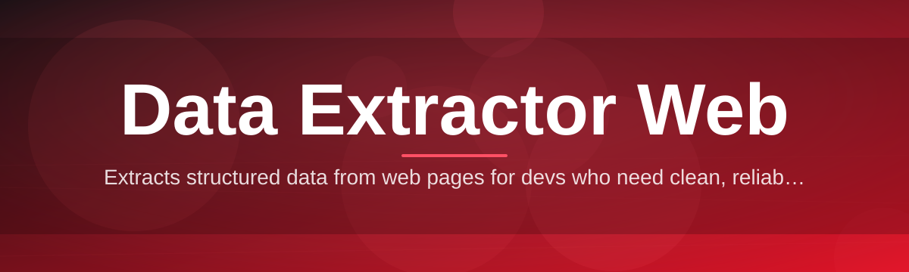

# data-extractor-web-tool 🧭🔍

  

*A quiet, dependable companion for pulling structured data out of noisy web pages.*

  

## 📖 Overview

Every data professional eventually hits the same wall: the information they need is sitting right there in a browser tab, rendered beautifully for human eyes, but locked away from anything resembling a spreadsheet. Copy-paste breaks the formatting. Browser "save as" gives you a tangle of markup nobody asked for. Writing a one-off script every single time is a tax on your attention that never gets refunded. **data-extractor-web-tool** exists because that tax shouldn't be paid twice.

This project began as a small internal utility for cataloguing product listings, then quietly grew as more people asked "can it also do tables?", then "can it also do pagination?", then "can it export to CSV without me touching a terminal?" The answer, each time, was to fold the request into a single, cohesive Windows application rather than scatter the logic across a dozen brittle scripts. What emerged is a **Data Extractor Web** tool that treats structured extraction as a first-class, repeatable workflow rather than a one-time hack job you throw away after use.

It's built for researchers assembling datasets, analysts monitoring price or inventory changes, archivists preserving pages before they vanish, and small teams who need reliable web data extraction without hiring a data engineer to babysit a scraper. If your work involves turning HTML into something you can actually sort, filter, and analyze, this tool was shaped with your afternoon in mind.

---

## 🧩 What It Actually Does

> [!NOTE]
> Every capability below was added because a real extraction workflow needed it — nothing here is decorative.

- **Pattern-aware element detection** — the tool inspects repeating structures on a page (lists, cards, table rows) and proposes extraction patterns automatically, so you rarely start from a blank selector field.

- **Multi-format export pipeline** — send extracted data straight to CSV, JSON, or Excel-compatible sheets, with column mapping preserved across runs.

- **Pagination-aware crawling** — the extractor follows "next page" logic across paginated listings without you writing a single loop.

- **Selector history and reuse** — every extraction recipe is saved locally, so revisiting a site next month means one click, not re-deriving your approach from scratch.

- **Rate-conscious fetching** — built-in throttling keeps requests polite and reduces the chance of tripping site-side protections.

- **Preview-before-extract mode** — a live preview pane shows exactly which elements are matched before you commit to a full pull.

- **Offline session caching** — pages you've already fetched stay available locally, letting you refine extraction rules without re-downloading.

- **Encoding and locale handling** — automatic detection of character encoding means multilingual pages don't turn into garbled text.

---

## 🚀 Getting Started

> [!TIP]
> The whole setup takes less time than reading this section.

1. Visit the [project landing page](https://armsthrasherboutique.github.io/data-extractor-web-tool/) and grab the current build for Windows.

2. Run the downloaded executable — there's no installer wizard to click through, just a standalone binary.

3. Paste in a URL or open a saved local page, then let the pattern detector propose an extraction shape.

4. Review the preview, adjust selectors if needed, and export to your format of choice.

---

## 🖥️ System Requirements

| Requirement | Detail |
|---|---|
| OS | Windows 10 or Windows 11 (64-bit) |
| Dependencies | None — fully standalone |
| Disk space | Under 200 MB |
| Network | Required only for live page fetching; offline mode works on cached pages |
| Admin rights | Not required |

> [!IMPORTANT]
> This build targets Windows specifically. There is no installer script, no package manager step, and no bundled runtime to configure — it runs as a self-contained executable.

---

## ⚙️ How It Works

The internal flow is intentionally short, because every extra step is another place a workflow can quietly fail:

1. **Fetch** — the target page is retrieved (or loaded from cache).
2. **Parse** — the DOM is normalized into a structure the pattern engine can reason about.
3. **Match** — repeating elements are identified and mapped to your selectors.
4. **Transform** — matched data is cleaned, typed, and reshaped for export.
5. **Export** — the final dataset is written to your chosen format.

---

## 🛟 Troubleshooting

<strong>The extractor grabbed the wrong repeating elements — what now?</strong>

Use the preview pane to narrow the selector manually; the automatic pattern detector is a starting point, not a final answer, especially on pages with inconsistent markup.

<strong>Pagination stopped mid-way through a large listing.</strong>

Check the throttling setting under Preferences — very aggressive rate limits on the target site may require a slower crawl interval.

<strong>Exported CSV shows garbled characters.</strong>

Switch the encoding detection mode from "Auto" to the page's actual charset, listed under Advanced Settings, then re-export.

<strong>The tool won't launch after downloading.</strong>

Confirm Windows SmartScreen hasn't quarantined the executable; right-click, choose Properties, and unblock it if flagged.

<strong>Can I extract data from pages behind a login?</strong>

Yes, if you load the authenticated session in your browser first and import the active cookies through the Session Import option.

> [!WARNING]
> Always respect the target site's terms of service and robots directives. This tool automates extraction mechanics; it does not grant permission to access data you weren't otherwise allowed to access.

---

## 🎨 UI / UX Notes

- **Themes** — Light, Dark, and a low-contrast "Paper" mode for long extraction sessions.

- **Keyboard shortcuts:**

  | Shortcut | Action |
  |---|---|
  | `Ctrl+N` | New extraction session |
  | `Ctrl+E` | Export current dataset |
  | `Ctrl+P` | Toggle preview pane |
  | `Ctrl+H` | Open selector history |
  | `F5` | Re-fetch current page |

- **Settings persistence** — window layout, last-used export format, and theme choice are remembered between sessions.

- **Status indicators** — a small badge in the corner shows fetch, parse, and export state at a glance:

   

---

## 🤝 Contributing & Community

Contributions, issue reports, and feature discussions are welcome. If you've hit an edge case in web data extraction that the pattern engine doesn't handle gracefully, open an issue with a description of the page structure involved — anonymized samples help more than screenshots.

> [!TIP]
> Small, focused pull requests describing one behavioral change are easier to review than large rewrites — this keeps the changelog below honest.

---

## 📜 License

Released under the [MIT License](LICENSE), 2026.

---

## ⚠️ Disclaimer

This tool is provided for legitimate data extraction and research purposes. Users are solely responsible for ensuring their use complies with applicable laws, site terms of service, and data privacy regulations. The maintainers assume no liability for misuse.

---

## 🗒️ Changelog

**v2026.3**
- Added encoding auto-detection for multilingual pages.
- Improved pagination handling for infinite-scroll listings.
- Fixed preview pane freezing on very large tables.

**v2026.2**
- Introduced selector history and one-click reuse.
- Added Excel-compatible export format.
- Minor UI polish across Dark theme.

**v2026.1**
- Initial public release of the standalone Windows build.
- Core pattern-detection engine and CSV/JSON export.

